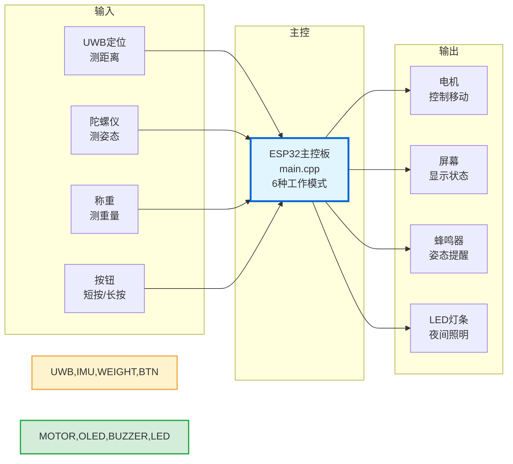
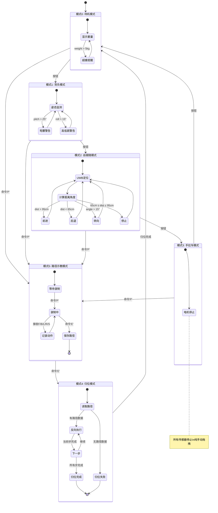
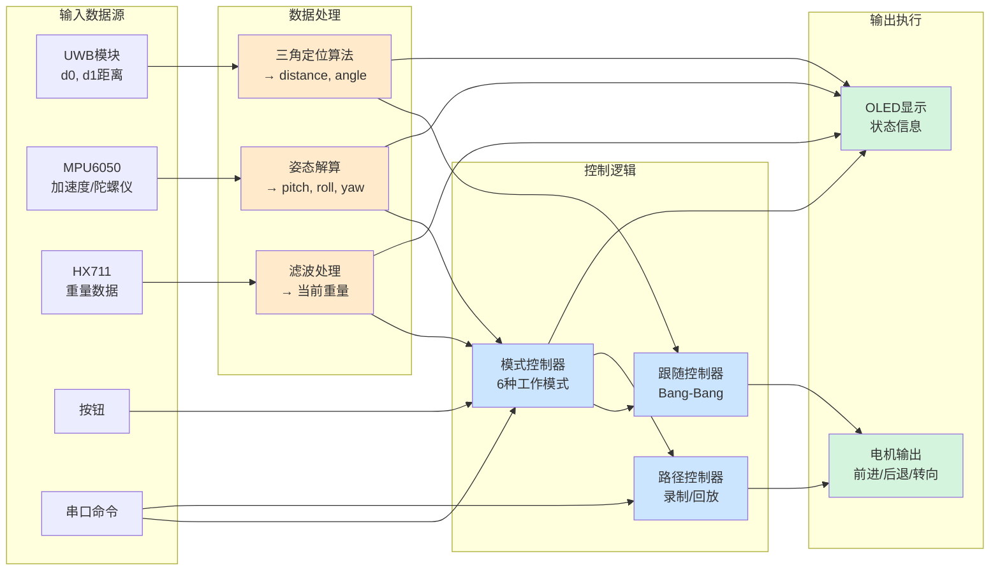

# 智能自动跟随书包 - 系统架构图

本文档包含系统的完整架构设计，包括硬件连接、软件分层、工作模式和数据流。

---

## 1. 系统整体架构

系统采用简单的三层架构：传感器 → 主控 → 执行器



### 工作原理

**输入（传感器）**
- UWB定位：测量人和书包之间的距离
- 陀螺仪：检测背书包时的姿态
- 称重：测量书包重量
- 按钮：短按切换模式，长按控制LED灯条

**主控（ESP32）**
- 运行6种工作模式
- 处理传感器数据
- 控制电机、显示和提醒设备

**输出（执行器）**
- 电机：驱动小车移动
- 屏幕：显示当前状态
- 蜂鸣器：姿态异常时声音提醒
- LED灯条：夜间照明和安全提醒

---

## 2. 工作模式状态机

系统有6种工作模式，通过按钮或串口命令切换：



### 模式切换规则

**按钮循环切换（主要4个模式）：**
```
待机 → 背负 → 跟随 → 手拉 → 待机 ...
```

**串口命令切换（特殊模式）：**
- 任意模式 + 命令`P` → 进入示教模式
- 示教模式 + 命令`E` → 进入归位模式
- 归位完成后 → 自动返回待机模式

### 各模式功能说明

| 模式 | 功能 | 传感器状态 | 电机状态 | 显示内容 | 蜂鸣器 |
|------|------|-----------|---------|---------|---------|
| 0-待机 | 显示重量，超重提醒 | 仅HX711工作 | 停止 | 当前重量 | - |
| 1-背负 | 检测姿态异常 | MPU6050工作 | 停止 | pitch/roll角度 | **姿态异常时响** |
| 2-跟随 | 自动跟随人移动 | UWB工作 | 自动控制 | 距离、角度 | - |
| 3-手拉 | 纯手动拖拽 | 全部停止 | 停止 | "Manual Pull" | - |
| 4-归位 | 按路径返回 | - | 自动控制 | 进度百分比 | - |
| 5-示教 | 遥控录制路径 | - | 遥控控制 | 录制状态 | - |

**LED灯条说明：**
- LED灯条独立于工作模式，可在任意模式下开启/关闭
- 通过长按按钮（>1秒）控制：长按一次打开，再长按一次关闭
- 适用场景：夜间行走、提高安全性

---

## 3. 数据流图

展示数据从传感器采集到执行器输出的完整流程：



### 数据处理流程

**1. 输入采集（10Hz-持续更新）**
- UWB：持续读取两个从机的距离数据
- IMU：10Hz更新加速度和陀螺仪数据
- Weight：10Hz读取重量（带低通滤波）
- 按钮：中断触发，防抖200ms
- 串口：异步接收命令

**2. 数据处理**
- **UWB处理**：双基站三角定位算法
  ```
  输入: d0, d1 (两个基站到标签的距离)
  输出: distance (前方距离), angle (偏转角度)
  算法: 余弦定理 + 三角函数
  ```

- **IMU处理**：姿态解算
  ```
  输入: 加速度(ax, ay, az), 陀螺仪(gx, gy, gz)
  输出: pitch (前后倾), roll (左右倾), yaw (航向角)
  算法: arctan2 + 简单积分
  ```

- **Weight处理**：低通滤波
  ```
  输入: HX711原始数据
  输出: 平滑的重量值
  算法: weight = weight * 0.8 + reading * 0.2
  ```

**3. 控制逻辑**
- **模式控制器**：根据按钮/命令切换模式
- **跟随控制器**：Bang-Bang控制
  ```
  if (距离 > 95cm) → 前进
  else if (距离 < 65cm) → 后退
  else if (角度 > 15°) → 右转
  else if (角度 < -15°) → 左转
  else → 停止
  ```
- **路径控制器**：记录动作序列并反向回放

**4. 输出执行（5Hz显示更新）**
- **电机输出**：全速模式，只有方向控制
- **OLED显示**：5Hz刷新，避免卡顿

---

## 4. 硬件连接总览

### ESP32 引脚分配

| 功能 | GPIO | 说明 |
|------|------|------|
| **I2C0 (OLED专用)** | | |
| SDA | 21 | SSD1306显示屏 |
| SCL | 22 | SSD1306显示屏 |
| **I2C1 (IMU专用)** | | |
| SDA | 25 | MPU6050陀螺仪 |
| SCL | 26 | MPU6050陀螺仪 |
| **串口2 (UWB0)** | | |
| RX | 16 | UWB从机0接收 |
| TX | 17 | UWB从机0发送 |
| **串口1 (UWB1)** | | |
| RX | 27 | UWB从机1接收 |
| TX | 13 | UWB从机1发送 |
| **电机驱动** | | |
| IN1 | 5 | 左电机正转 |
| IN2 | 14 | 左电机反转 |
| IN3 | 32 | 右电机正转 |
| IN4 | 33 | 右电机反转 |
| **HX711称重** | | |
| DOUT | 18 | 数据输出 |
| SCK | 19 | 时钟信号 |
| **按钮** | | |
| BTN | 4 | 短按切换模式，长按控制LED（上拉） |
| **蜂鸣器** | | |
| BUZZER | 待定 | 有源蜂鸣器，姿态异常提醒 |
| **LED灯条** | | |
| LED_STRIP | 待定 | 夜间照明，长按按钮控制 |

### 电源分配

| 模块 | 电源 | 电流 |
|------|------|------|
| ESP32 | 5V (UPS) | ~200mA |
| L298N | 12V (UPS) | - |
| 左/右电机 | 12V (via L298N) | ~0.7A × 2 |
| UWB × 2 | 3.3V (ESP32) | ~100mA |
| MPU6050 | 3.3V (ESP32) | ~5mA |
| SSD1306 | 3.3V (ESP32) | ~10mA |
| HX711 | 5V (ESP32) | ~10mA |
| 有源蜂鸣器 | 3.3V/5V (ESP32) | ~30mA |
| LED灯条 | 5V/12V (UPS) | 视灯珠数量 |

### 按钮控制逻辑

| 操作 | 检测条件 | 功能 |
|------|----------|------|
| **短按** | 按下时长 < 1秒 | 循环切换工作模式 (待机→背负→跟随→手拉→待机) |
| **长按** | 按下时长 ≥ 1秒 | 切换LED灯条开/关状态 (不影响当前工作模式) |

**实现说明：**
- 防抖延迟：200ms
- 按钮释放时判断按下时长
- 如果时长 < 1秒 → 切换模式
- 如果时长 ≥ 1秒 → 切换LED灯条

---

## 5. 关键算法

### 5.1 UWB双基站定位算法

基于三角测量原理，通过两个已知位置的基站到标签的距离，计算标签相对于小车的位置和角度。

**几何模型：**
```
        人（标签）
           *
          /|\
         / | \
      d0/  |  \d1
       /   |y  \
      /    |    \
   [从机0]----[从机1]
      ←--- L ---→
         小车前端
```

**计算公式：**
```cpp
// 已知：L = 25cm (基站间距), d0, d1 (测量距离)

// 计算左右偏移 x
float x = (d0*d0 - d1*d1) / (2*L);

// 计算前方距离 y
float y_sq = d0*d0 - (x + L/2)*(x + L/2);
float y = (y_sq > 0) ? sqrt(y_sq) : 0;

// 计算总距离和角度
float distance = y;
float angle = atan2(x, y) * 180.0 / PI;
```

**结果解释：**
- `distance`：标签在小车正前方的距离（cm）
- `angle`：标签相对小车中线的偏转角度（度）
  - 正值：标签在右边
  - 负值：标签在左边
  - 0：标签在正前方

### 5.2 姿态检测算法

基于MPU6050加速度计数据计算倾斜角度。

**计算公式：**
```cpp
// 输入：加速度 (ax, ay, az)

// 前后倾斜（pitch）
float pitch = atan2(ay, sqrt(ax*ax + az*az)) * 180.0 / PI;

// 左右倾斜（roll）
float roll = atan2(ax, sqrt(ay*ay + az*az)) * 180.0 / PI;

// 检测异常
if (pitch > 25°)  → 弯腰/驼背
if (roll > 15°)   → 高低肩
```

### 5.3 路径示教与归位

**示教阶段：**
```cpp
struct PathStep {
    uint8_t action;    // 0=停止, 1=前进, 2=后退, 3=左转, 4=右转
    uint16_t duration; // 持续时间 (ms)
};

// 记录每个动作和持续时间
path[i] = {action: FORWARD, duration: 2000};  // 前进2秒
```

**归位阶段：**
```cpp
// 反向执行
for (int i = pathLength-1; i >= 0; i--) {
    uint8_t reverseAction = reverse(path[i].action);
    executeAction(reverseAction, path[i].duration);
}

// 动作反转规则
前进 ↔ 后退
左转 ↔ 右转
停止 → 停止
```

---

## 6. 性能指标

| 指标 | 数值 | 说明 |
|------|------|------|
| 主循环频率 | 不限 | loop()无延迟，尽可能快 |
| 传感器更新 | 10Hz | IMU、Weight每100ms更新 |
| UWB更新 | 实时 | 持续读取串口数据 |
| 显示刷新 | 5Hz | 每200ms更新屏幕 |
| 按钮防抖 | 200ms | 避免误触发 |
| UWB超时 | 2秒 | 超过2秒无数据视为断连 |
| 跟随目标距离 | 80cm | 期望保持距离 |
| 跟随死区 | ±15cm | 65-95cm范围内不动作 |
| 角度死区 | ±15° | 小角度偏差不转向 |
| 最大路径步数 | 100步 | 受RAM限制 |

---

## 7. 未来优化方向

### 待实现功能（优先级排序）

**高优先级（核心功能）**
- [ ] UWB二进制数据帧解析（当前为临时文本解析）
- [ ] 蜂鸣器提醒功能（姿态异常时声音报警）
- [ ] LED灯条控制（长按按钮开关，夜间照明）
- [ ] 按钮长按/短按区分逻辑

**中优先级（增强功能）**
- [ ] 蓝牙遥控功能（替代USB串口）
- [ ] UWB数据卡尔曼滤波（减少抖动）
- [ ] 姿态数据互补滤波（提高精度）
- [ ] 路径持久化存储（保存到Flash）

**低优先级（改善体验）**
- [ ] PWM调速（平滑跟随控制）
- [ ] PID跟随控制（替代Bang-Bang）
- [ ] 电量监测与显示
- [ ] OLED动画效果

### 性能优化
- [ ] 减少OLED刷新时阻塞时间
- [ ] 优化路径回放精度
- [ ] 增加异常处理和错误恢复机制
- [ ] 添加日志系统便于调试

### 硬件改进建议
- [ ] 增加电量指示LED
- [ ] 增加紧急停止按钮
- [ ] 更换更精确的UWB模块
- [ ] 添加避障传感器（超声波/红外）

---

**文档版本：** v1.0
**最后更新：** 2026-01-02
**作者：** Claude Code
