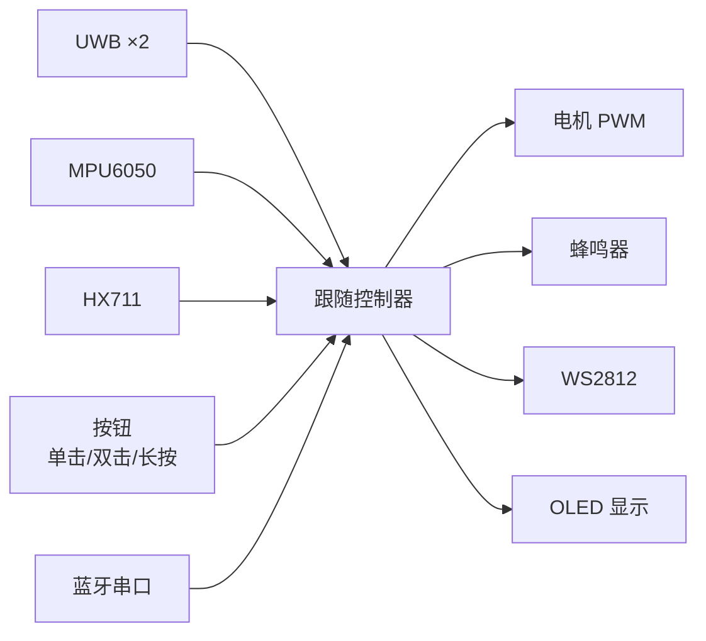
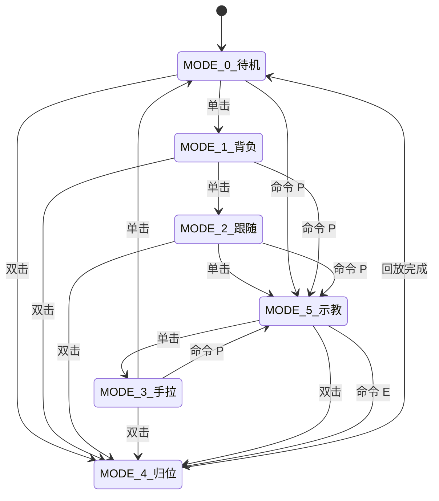

# 智能自动跟随书包 - 系统架构说明

本文档描述当前固件的核心结构、工作模式与控制逻辑，内容与代码保持一致。

## 1. 总体架构

## 2. 工作模式状态机

## 3. 模式功能说明

| 模式 | 功能 | 传感器 | 电机 | 备注 |
|---|---|---|---|---|
| 待机 | 显示重量 | HX711 | 停止 | 超过 1kg 三声提示 |
| 背负 | 姿态检测 | MPU6050 | 停止 | 弯腰/驼背/高低肩蜂鸣 |
| 跟随 | 自动跟随 | UWB | 自动 | 距离 <=1m 停止 |
| 手拉 | 手动推拉 | 无 | 停止 | 仅手拉 |
| 示教 | 路径录制 | 蓝牙/串口 | 手动 | 记录动作和时长 |
| 归位 | 路径回放 | 无 | 自动 | 回放示教路线 |

## 4. 按钮逻辑

| 事件 | 触发条件 | 行为 |
|---|---|---|
| 单击 | 按下释放 | 模式循环切换 |
| 双击 | 两次点击间隔 <= 400ms | 进入归位模式 |
| 长按 | 按下 >= 1s | 切换 WS2812 灯带 |

## 5. 控制逻辑要点

- 跟随控制：距离滤波 + 转向迟滞 + 指令保持，避免抖动
- 近距离保护：距离 <= 1m 停止
- 蜂鸣器：背负姿态异常持续鸣；待机超重三声提示
- 示教：记录动作切换时长；归位为回放示教路线
- 速度：按模式切换速度（跟随/示教/归位各自配置）

## 6. 关键参数

- UWB：基线 28cm、角度反向/偏移可调
- 跟随：目标 80cm、死区 ±15cm、转向迟滞 35/15°
- 速度：跟随前进 150，示教/归位 80% PWM

## 7. TODO（未实现）

- PID 跟随控制
- OLED 动画与更平滑刷新
- 电量指示
- 紧急停止按钮
